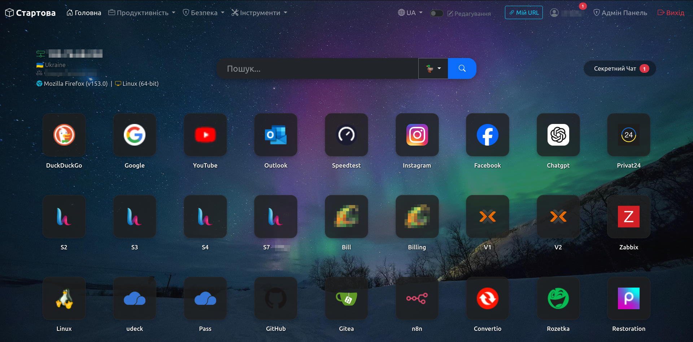

# StartPage & Web Tools 2.2.0 (Security & Features Update)


[](https://github.com/leshost/startpage)


Багатофункціональна стартова сторінка (Startpage) для браузера з інтегрованими корисними веб-інструментами, панеллю адміністратора та сучасним темним дизайном.

## 🚀 Функціонал проекту

Цей проект складається з 4-х основних інструментів, об'єднаних єдиним сучасним інтерфейсом (UI):

### 1. 🏠 Стартова сторінка (`index.php`)
- **Менеджер закладок:** Зберігає ваші улюблені сайти у вигляді красивих плиток з іконками.
- **Інформація про клієнта:** Автоматично визначає та показує вашу IP-адресу, назву і версію браузера, а також операційну систему.
- **Панель адміністратора:** Можливість додавати та видаляти закладки в режимі реального часу (без перезавантаження сторінки) за допомогою AJAX.
- **Підтримка користувачів:** Можливість фільтрувати закладки для конкретних користувачів через GET-параметр `?user=`.

### 2. 💰 Фінансовий калькулятор (`finance.php`)
- Допомагає правильно розподіляти доходи за популярними фінансовими правилами.
- Має вбудовані пресети розподілу (наприклад, 60/20/20, 70/15/15 тощо).
- Автоматично розраховує місячні та річні накопичення.
- **Локальне збереження:** Запам'ятовує ваші дані у браузері (`localStorage`), тож вам не доведеться вводити їх знову при наступному візиті.

### 3. 🔐 Генератор паролів (`pass.php`)
- Гнучке налаштування: вибір довжини (від 4 до 64 символів), використання цифр, букв та спецсимволів.
- **Безпечна генерація:** Використовує надійний криптографічний API браузера (`window.crypto.getRandomValues`).
- **Індикатор надійності:** Миттєво показує силу згенерованого пароля.
- Копіювання пароля в буфер обміну в один клік зі спливаючим Toast-повідомленням.

### 4. 🛡️ Перевірка паролів (`check.php`)
- Дозволяє перевірити, чи не був скомпрометований ваш пароль у відомих витоках баз даних.
- **Абсолютна безпека:** Працює на базі API *Have I Been Pwned*, використовуючи модель **k-anonymity**. На сервер передаються лише перші 5 символів SHA-1 хешу вашого пароля. Ваш реальний пароль ніколи не залишає ваш комп'ютер.

### 5. 📋 Канбан-дошка (`kanban.php`)
- **Управління проектами:** Створюйте різні проекти та сортуйте завдання.
- **Спільний доступ:** Діліться проектами з друзями, переглядайте, хто створив і хто змінив завдання.
- **Система переглядів:** Відстежуйте, хто і коли переглянув ваші завдання у спільних проектах.
- **Інтерактивність:** Перетягуйте завдання між колонками за допомогою SortableJS.

### 6. 💬 Секретний Чат (E2EE) (`chat.php`)
- **Наскрізне шифрування (End-to-End Encryption):** Повідомлення шифруються безпосередньо у браузері, сервер зберігає лише зашифрований текст.
- **Система друзів:** Додавайте друзів для спілкування та спільної роботи над Канбан-дошками.

### 7. 🛠️ Dev Multi-Tool (`dev-tools.php`)
- Набір корисних інструментів для розробників: кодування/декодування (Base64, URL), генерація хешів (MD5, SHA), робота з UNIX-часом.

### 8. 📝 JSON Форматер (`json.php`)
- Зручний інструмент для валідації, форматування та читання JSON-даних.

### 9. 📱 QR-Генератор (`qr.php`)
- Миттєва генерація QR-кодів для текстів або посилань.

### 10. 📝 Секретні нотатки (E2EE) (`notes.php`)
- **Наскрізне шифрування:** Зберігайте ваші особисті записи зашифрованими (AES-GCM + RSA-OAEP). Сервер не має доступу до тексту.
- **Підтримка Markdown:** Зручний редактор з підтримкою розмітки Markdown.
- **Синхронізація сесії:** Розблокований стан зберігається в `sessionStorage` для швидкого доступу між сторінками без повторного вводу пароля.
- **Захист заголовків:** Навіть заголовки нотаток шифруються перед збереженням у БД.

### 11. 📩 Одноразові самознищувані повідомлення (`secret.php`)
- **Аналог Privnote (Zero-Knowledge):** Створюйте секретні лінки. Ключ вбудовується в хеш URL (після `#`), тому сервер ніколи його не бачить.
- **Самознищення:** Повідомлення миттєво і назавжди видаляється з БД після першого прочитання отримувачем.
- **Гнучкі налаштування:** Додайте власний пароль, вимкніть автовидалення (зробіть постійним) або вимкніть шифрування.
- **Гостьовий доступ:** Для прочитання секрету отримувачу не потрібно авторизовуватися в системі.

## 🌟 Що нового у версії 2.2.0
- Додано модуль **Секретні нотатки** з підтримкою Markdown та E2EE.
- Додано модуль **Одноразові самознищувані повідомлення** з гостьовим доступом.
- Додано шифрування заголовків для нотаток.
- Виправлено баг з дешифруванням E2EE в браузері (відновлено коректну обробку `TextDecoder`).
- Покращено архітектуру сесій для Zero-Knowledge шифрування.

## 🛠️ Технологічний стек

- **Бекенд:** PHP 8+
- **База даних:** MySQL / MariaDB (PDO)
- **Фронтенд:** HTML5, CSS3, JavaScript (Fetch API / ES6)
- **UI Фреймворк:** Bootstrap 5.3 (Dark Mode)
- **Сповіщення:** Toastr.js
- **Іконки:** Bootstrap Icons

## ⚙️ Встановлення та налаштування

1. **Клонуйте репозиторій:**
   ```bash
   git clone https://github.com/leshost/startpage.git
   cd startpage
   ```

2. **Налаштуйте базу даних:**
   Створіть порожню базу даних у MySQL/MariaDB.
   **Вам НЕ потрібно створювати таблиці вручну!** При першому відкритті модулів система автоматично створює усі необхідні таблиці та зв'язки між ними:
   - `users` (зберігання акаунтів, хешів паролів та E2EE ключів)
   - `sites` (зберігання закладок, їх порядку, іконок та прив'язка до користувача)
   - `friends`, `messages` (система друзів та наскрізно зашифрований чат)
   - `kanban_projects`, `tasks`, `kanban_shares`, `task_views` (Канбан-система зі спільним доступом та переглядами)

3. **Налаштуйте підключення (файл `.env`):**
   Для безпеки паролі більше не зберігаються у коді. Створіть файл `.env` у захищеній папці (на рівень вище папки з сайтом, наприклад у `private/.env`) і вкажіть там свої дані доступу до бази даних:
   ```ini
   DB_HOST="localhost"
   DB_NAME="ваша_база_даних"
   DB_USER="користувач_бд"
   DB_PASS="пароль_бд"
   ```
   *Шлях до файлу `.env` налаштовується у `config/config.php`.*

4. **Розгортання:**
   Завантажте всі файли на ваш веб-сервер, який підтримує PHP (Apache, Nginx). Переконайтеся, що на сервері увімкнені розширення `pdo_mysql`.

## 🛡️ Оновлення Безпеки (Версія 2.1.0)

У версії 2.1.0 було проведено масштабний аудит безпеки та усунено ряд критичних вразливостей для забезпечення надійного захисту даних користувачів:

- **🔐 Справжнє наскрізне шифрування (E2EE):** Приватний ключ від чату більше не зберігається на сервері. Сервер тепер працює за принципом Zero-Knowledge. Відповідальність за зберігання ключа лежить виключно на користувачі (через експорт файлу).
- **👀 Безпечний Read-Only Автологін:** Використання секретного посилання `/?user=SECRET` тепер надає доступ лише до перегляду особистих закладок та некритичних утиліт. Для редагування, чату та Канбану потрібна повноцінна авторизація з паролем. 
- **🌐 Захист від витоку Referer:** Секретні ключі більше не залишаються в адресному рядку після входу, запобігаючи їх витоку на сторонні сайти.
- **🛡️ Content Security Policy (CSP):** Додано базові заголовки CSP для захисту від міжсайтового скриптингу (XSS).
- **🍪 Hardened Cookies:** Сесійні кукі тепер створюються з флагами `Secure`, `HttpOnly` та `SameSite=Strict`.
- **🕵️‍♂️ Захист від підробки IP (Spoofing):** Функція отримання IP-адреси оновлена для безпечної та коректної роботи за Cloudflare (використовується `CF-Connecting-IP`).
- **🛑 Суворі перевірки прав доступу:** Усунено вразливість IDOR у чаті (тепер повідомлення можна надсилати лише підтвердженим друзям).
- **🔒 Захист від витоку даних БД:** Більше жодних сирих `PDOException`. Всі критичні помилки бази даних логуються внутрішньо, а користувачам відображаються безпечні загальні повідомлення.
- **🔑 Посилення паролів:** Мінімальна довжина пароля збільшена з 6 до 8 символів.

## 🔒 Загальна архітектура безпеки

- **Сесії:** Для доступу до приватних модулів використовуються безпечні PHP-сесії.
- **AJAX:** Взаємодія з БД захищена перевіркою авторизації на стороні сервера.
- Для входу в адмін-панель натисніть на іконку шестерні (⚙️) у верхньому правому куті навігаційного меню.

## 📄 Ліцензія
Цей проект розповсюджується під ліцензією [MIT](https://opensource.org/licenses/MIT). Ви можете вільно використовувати, змінювати та поширювати цей код.